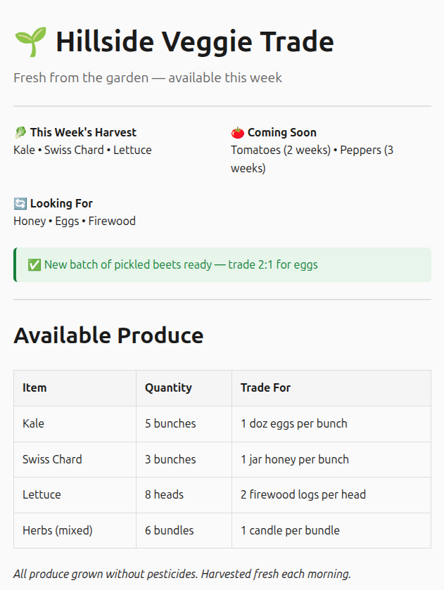

# NOMAD-ComRepo

Example `.com` files for the NOMAD platform.

**Official repository from [@DimensionDevices](https://github.com/DimensionDevices).**

---

## Table of Contents

- [What is a .com file?](#what-is-a-com-file)
- [Quick Start](#quick-start)
- [File Size Limit](#file-size-limit)
- [Metadata Directives](#metadata-directives)
- [Content Blocks](#content-blocks)
  - [Headings](#headings)
  - [Text Elements](#text-elements)
  - [Links & Buttons](#links--buttons)
  - [Media](#media)
  - [Alerts & Progress](#alerts--progress)
  - [Dividers](#dividers)
- [Complex Structures](#complex-structures)
  - [Lists](#lists)
  - [Tables](#tables)
  - [Grids](#grids)
  - [Cards](#cards)
- [Custom Code](#custom-code)
  - [CSS](#style-css)
  - [JavaScript](#script-javascript)
  - [Raw HTML](#customhtml)
- [Markdown Support](#markdown-support)
- [Full Example](#full-example)
- [Tips & Limitations](#tips--limitations)
- [Data Storage](#data-storage)

---

## What is a .com file?

A `.com` file is a plain-text document that renders as a full web page inside the NOMAD interface. You write it using simple directives (like `PAGE:`, `TEXT:`, `IMAGE:`) and save it with a `.com` extension. HTML completely optional.

---

## Quick Start

1. Create a new text file.
2. Add at least a `PAGE:` directive at the top.
3. Add content using the directives below.
4. Save with a `.com` extension (max 6 characters before the dot).
5. Upload or serve it through your NOMAD device.

> 💡 **Tip:** Use the NOMAD Studio's visual editor if you prefer a GUI; it generates these directives for you.

---

## File Size Limit

**All `.com` files must stay under 20 KB.**  
This includes embedded images (base64), custom CSS, and JavaScript. Compress images before embedding, and minify any custom code.

---

## Metadata Directives

Place these at the very top of your file. They control page-level settings and are **not** rendered in the body.

| Directive | Format | Example | Purpose |
|-----------|--------|---------|---------|
| `PAGE:` | `PAGE: Title` | `PAGE: My Dashboard` | Browser tab title (required) |
| `COLOR:` | `COLOR: #hex` | `COLOR: #ff6b6b` | Primary theme color (links, buttons, accents) |
| `AUTHOR:` | `AUTHOR: Name` | `AUTHOR: Jane Doe` | Author metadata |
| `DATE:` | `DATE: YYYY-MM-DD` | `DATE: 2024-01-15` | Publication date |

**Example:**
```
PAGE: NOMAD Tips
COLOR: #2ecc71
AUTHOR: BigJohn
DATE: 2024-12-01
```

---

## Content Blocks

Each block starts with a directive on its own line.

### Headings

| Directive | Renders As | Example |
|-----------|------------|---------|
| `BIGHEADER:` | Large H1 | `BIGHEADER: Welcome` |
| `HEADER:` | Medium H2 | `HEADER: Features` |
| `SUBHEADER:` | Small H3 | `SUBHEADER: Getting Started` |
| `SUBTITLE:` | Subtitle text | `SUBTITLE: A beginner's guide` |

### Text Elements

| Directive | Renders As | Example |
|-----------|------------|---------|
| `TEXT:` | Paragraph | `TEXT: This is a sentence.` |
| `PARAGRAPH:` | Paragraph (alias) | `PARAGRAPH: Another paragraph` |
| `QUOTE:` | Blockquote | `QUOTE: To be or not to be` |
| `CODE:` | Code block | `CODE: const x = 42;` |

### Links & Buttons

| Directive | Format | Example |
|-----------|--------|---------|
| `LINK:` | `LINK: URL \| Text` | `LINK: https://example.com \| Click here` |
| `BUTTON:` | `BUTTON: Label \| URL` | `BUTTON: Download \| /files/myfile.txt` |

> `BUTTON:` uses the label first, then the URL-note the order.

### Media

| Directive | Format | Example |
|-----------|--------|---------|
| `IMAGE:` | `IMAGE: Alt \| dataURL` or `IMAGE: URL \| Alt` | `IMAGE: My photo \| data:image/png;base64,...` |

**Important:** Images **must** be embedded as Data URLs (base64). Due to the 20 KB limit, use small, compressed images.

### Alerts & Progress

| Directive | Format | Example |
|-----------|--------|---------|
| `ALERT:` | `ALERT: type \| message` | `ALERT: warning \| Low battery!` |
| `PROGRESS:` | `PROGRESS: value` | `PROGRESS: 75` |

**Alert types:** `info`, `warning`, `error`, `success`

### Dividers

| Directive | Effect |
|-----------|--------|
| `DIVIDER` | Horizontal rule (`<hr>`) |

---

## Complex Structures

These use start/end blocks with content in between.

### Lists

```
LIST-START
ITEM: First item
ITEM: Second item
ITEM: Third item
LIST-END
```

Renders as a bulleted list.

### Tables

```
TABLE-START
HEADER: Name | Age | City
ROW: Alice | 28 | London
ROW: Bob   | 34 | Paris
TABLE-END
```

Separate columns with the pipe character `|`.

### Grids

```
GRID-START
COLUMN: First column content
COLUMN: Second column content
COLUMN: Third column content
GRID-END
```

Creates equal-width columns that wrap on mobile. Useful for dashboards or feature comparisons.

### Cards

```
CARD-START
## Inside a card

This text is inside a bordered, rounded box.
CARD-END
```

Cards support markdown formatting inside them. Great for highlighting key information.

---

## Custom Code

Use these blocks when the built-in directives aren't enough.

### STYLE (CSS)

```
STYLE-START
.block:hover { background: #f0f0f0; }
.custom-class { padding: 1rem; }
STYLE-END
```

Add custom CSS. **Minify** your CSS to save space.

### SCRIPT (JavaScript)

```
SCRIPT-START
console.log("Hello from NOMAD!");
document.querySelector('h1').style.color = 'red';
SCRIPT-END
```

Add JavaScript. **Minify** to stay under 20 KB.

### CUSTOMHTML

```
CUSTOMHTML-START
<div class="my-widget">
  <button onclick="alert('Clicked!')">Click me</button>
</div>
CUSTOMHTML-END
```

Insert raw HTML for complex widgets or layouts. **Minify** your HTML.

> **Note:** All custom HTML/CSS/JS runs in a sandboxed environment.

---

## Markdown Support

You can use basic Markdown inside `TEXT:`, `QUOTE:`, and other text blocks:

| Syntax | Result |
|--------|--------|
| `**bold**` | **bold** |
| `*italic*` | *italic* |
| `` `code` `` | `code` |
| `[text](url)` | [text](url) |

---

## Full Example

Here's a complete `.com` file screenshot and template code that combines many of the features above, note that this uses the default styling, which may be overwritten by using the STYLE-START and STYLE-END directives:



```
PAGE: Hillside Veggie Trade
COLOR: #2e7d32
AUTHOR: GreenValley Farm
DATE: 2025-06-01

BIGHEADER: 🌱 Hillside Veggie Trade

SUBTITLE: Available this week!

DIVIDER

GRID-START
COLUMN: 🥬 **This Week's Harvest**  
Kale • Swiss Chard • Lettuce
COLUMN: 🍅 **Coming Soon**  
Tomatoes (2 weeks) • Peppers (3 weeks)
COLUMN: 🔄 **Looking For**  
Honey • Eggs • Firewood
GRID-END

ALERT: success | New batch of pickled beets ready - trade 2:1 for eggs

DIVIDER

HEADER: Available Produce

TABLE-START
HEADER: Item | Quantity | Trade For
ROW: Kale | 5 bunches | 1 doz eggs per bunch
ROW: Swiss Chard | 3 bunches | 1 jar honey per bunch
ROW: Lettuce | 8 heads | 2 firewood logs per head
ROW: Herbs (mixed) | 6 bundles | 1 candle per bundle
TABLE-END

TEXT: *All produce grown without pesticides. Harvested fresh each morning.*

CARD-START
**Trade Info**  
📍 Pickup at the farm stand (7am-10am, Sat-Sun)  
📡 Send a NOMAD message to confirm trades  
🔄 Open to barter, just ask!
CARD-END

QUOTE: "Good food, good folks, good trade."
```

---

## Tips & Limitations

- **20 KB hard limit**: every byte counts. Minify CSS/JS/HTML and compress images before embedding.
- **Max 6 characters** for the filename (before the `.com` extension).
- **Always preview** before saving to your device.
- **Use the Studio** for visual editing; it writes these directives for you.
- **Data URLs for images only**: no external image hosting.
- **Sandboxed environment**: your custom code runs safely.

---

## Data Storage

Every `.com` page can save and load its own small JSON "database" on the device-no external server needed. This is handy for things like counters, saved settings, high scores, or simple guestbooks that persist between visits.

Storage lives separately from your page file, so it isn't counted against your page's 20 KB limit-but it has its own cap:

> 💡 **10 KB hard limit** per site's stored JSON document.

### How it works

Your page's own JavaScript (inside a `SCRIPT-START`/`SCRIPT-END` or `CUSTOMHTML-START`/`CUSTOMHTML-END` block) talks to a small set of endpoints using `fetch()`. Each site gets its own isolated document, automatically matched to the page you're viewing-**you don't need to tell it your own filename** if you're viewing the page through its own address. If you're testing through the Studio or an IP address directly, pass `filename` explicitly instead (see [Testing Locally](#testing-locally) below).

| Endpoint | Method | Purpose |
|----------|--------|---------|
| `/api/db/get` | GET | Read the whole document, or a single key |
| `/api/db/set` | POST | Save/update one or more keys |
| `/api/db/remove` | POST | Delete one or more keys |
| `/api/db/clear` | POST | Wipe the entire document |

All four respond with the same JSON envelope:

```
{ "success": true, "filename": "yoursite.com", "data": <whatever you asked for> }
```

or, on failure:

```
{ "success": false, "error": "..." }
```

### Reading data

```
SCRIPT-START
async function loadScore() {
  const resp = await fetch('/api/db/get?key=score');
  const json = await resp.json();
  const score = (json.success && json.data !== null) ? json.data : 0;
  document.getElementById('score').textContent = score;
}
loadScore();
SCRIPT-END
```

Leave off `?key=` to get the whole document back instead of a single value.

### Saving data

```
SCRIPT-START
async function saveScore(value) {
  await fetch('/api/db/set', {
    method: 'POST',
    headers: { 'Content-Type': 'application/json' },
    body: JSON.stringify({ data: { score: value } })
  });
}
SCRIPT-END
```

`set` merges whatever keys you send into the existing document-it won't touch other keys you've already saved.

### Removing data

```
SCRIPT-START
async function resetScore() {
  await fetch('/api/db/remove', {
    method: 'POST',
    headers: { 'Content-Type': 'application/json' },
    body: JSON.stringify({ key: 'score' })
  });
}
SCRIPT-END
```

Pass `"keys": ["a", "b"]` instead of `"key"` to remove several fields at once.

### Testing locally

If you're previewing a file directly (rather than visiting your site's own address), the device can't tell which site is asking, so add `filename` to every call:

```
fetch('/api/db/get?filename=yoursite.com&key=score')

fetch('/api/db/set', {
  method: 'POST',
  headers: { 'Content-Type': 'application/json' },
  body: JSON.stringify({ filename: 'yoursite.com', data: { score: 10 } })
});
```

Match `filename` to whatever you actually named your `.com` file, or you'll end up reading/writing a different site's data.

### Limits & notes

- **10 KB per site**, enforced on save-if a `set` would push the document over the limit, it's rejected and your existing data is left untouched.
- Storage is a flat set of keys and values-there's no nesting rules enforced, but keep it simple (numbers, strings, small objects/arrays) for reliability.
- Data persists across page reloads and device reboots, but isn't backed up anywhere else-treat it as convenient, not durable.
- Each site's storage is isolated; you can't read or write another site's data unless you explicitly pass its `filename`.

© 2026 "NOMAD: Network for Open Messaging and Data" is Copyright of DimensionDevices